# Vulcan2 Macro Reference

A guide to every custom macro in this config — what it does, its step-by-step
flow, and the gotchas behind it. Written for future improvement/debugging.

> **Rendering:** flowcharts are [Mermaid](https://mermaid.js.org/) fenced blocks.
> They render inline on GitHub and in VS Code (Markdown Preview Mermaid extension).

**Machine:** IDEX (two independent X carriages), Cartesian, **Y bed-slinger**.
Z homes via a magnetic dockable **Euclid/Klicky probe** (the *only* Z reference).

---

## How to read this doc

Each macro is listed as:

> **`MACRO_NAME`** — *file · [internal]* — one-line purpose.
> Steps / notes.

- **[internal]** macros (usually `_`-prefixed) are called by other macros, not by the user.
- Trivial one-line aliases get a one-line entry; branching/multi-stage flows get a flowchart.
- "→" means "calls".

---

## Cross-cutting concepts (read these first)

Four ideas explain ~80% of the "why" in this config.

### 1. Render-time vs run-time — the two-stage pattern

A `gcode_macro`'s Jinja template is **fully rendered before any of its commands
execute**. So you **cannot** `QUERY_PROBE` and then read `printer.probe.last_query`
in the *same* macro — the read happens at render time and sees the **previous**
query's value.

**Pattern:** macro A runs `QUERY_PROBE` then calls macro B; B's template renders
only when the dispatcher reaches that call — *after* the query ran — so B reads a
fresh value. You'll see this everywhere: `PROBEON`→`_PROBE_VERIFY`,
`PROBE_DROPOFF`→`_PROBE_DROPOFF_SENSE`, `ASSERT_PROBE_DOCKED`→`_ASSERT_PROBE_DOCKED_CHECK`,
the whole `_PSP_*` chain. The same rule is why `PROBE` (in `_SENSE`) and reading
`last_z_result` (in `_STRIP`) live in different macros.

### 2. Probe wiring is Normally-Closed (NC) — polarity matters

Wired NC (`HC32F460.cfg`), so **detachment is fail-safe**:

| Physical state | `printer.probe.last_query` |
|---|---|
| Attached & idle | **False** (open) |
| Attached & pressed / detached / broken wire | **True** (TRIGGERED) |

So in macros: **attached = `not last_query`**. A probe that falls off reads as an
immediate trigger instead of letting the nozzle crash.

### 3. IDEX carriage / tool mapping

| Name | Carriage | Tool cmd | Extruder | Side | X endstop |
|---|---|---|---|---|---|
| **E1** | `0` (`stepper_x`) | `T0` | `extruder` | left | `-54` |
| **E2** | `1` (`dual_carriage`) | `T1` | `extruder1` | right | `354` |

`_IDEX_MODE.idex_mode`: **0 = dual-material** (one carriage prints at a time),
**1 = copy**, **2 = mirror** (both carriages move together — they must **not** be
homed/moved independently, hence the copy/mirror guards).

### 4. The probe is the Z reference

`[stepper_z] endstop_pin: probe:z_virtual_endstop`. Consequences woven through
every subsystem:
- **Homing Z requires the probe attached** (the guarded `G28`).
- **Printing requires the probe removed** (`ASSERT_PROBE_DOCKED`).
- The probe can't be on and off at once → the interactive `PRINT_START_PROBED`
  flow and the dock macros exist to manage that tension.

---

## Macro map (subsystems)

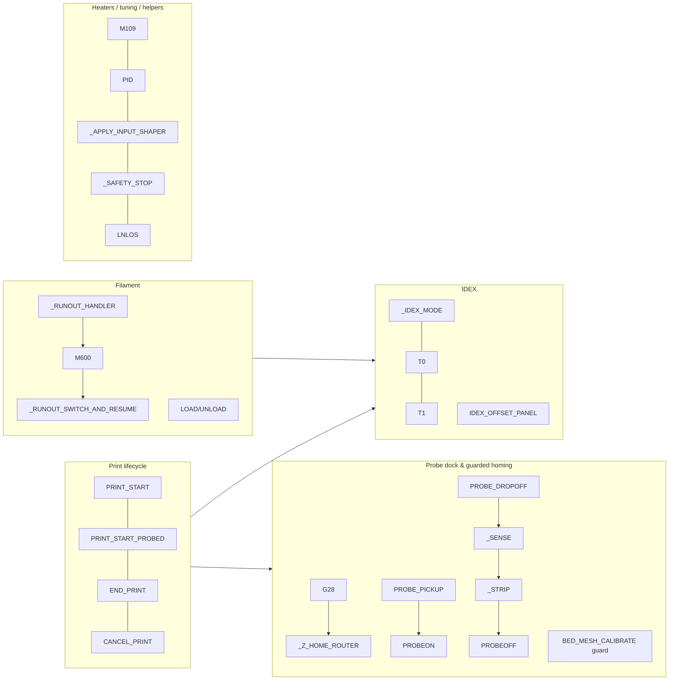

---

# 0. Foundations (prerequisites) — start here

These are the **leaf macros every other flow calls**. Understand them first; the
subsystem sections (§1–§6) then compose them into the real routines.

**Dependency tiers (read bottom-up):**

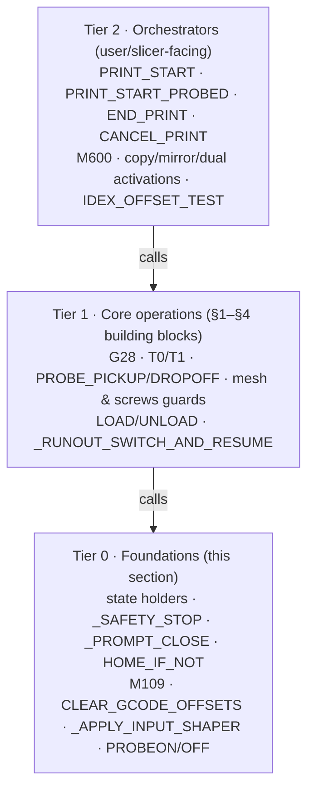

**Reading order:** this section → §1 probe/homing → §2 IDEX → §3 print lifecycle →
§4 filament → §5 heaters/tuning → §6 helpers. The orchestrators in §3 sit at the top
and pull in everything below them.

## Tier 0a — State holders

No-op bodies; other macros read their `variable_*`. (Subsystem-local holders
`_PSP_STATE`, `_RUNOUT_STATE`, `_IDEX_PANEL_STATE` are documented with their flows.)

- **`LNLOS`** — *_host_deps.cfg* — the **per-printer settings holder**: dock geometry
  (`probe_dock_sense_xoffset`, `probe_dock_release`, `probe_dock_scrape_drop`,
  `probe_pickup_zraise`), PID targets, `standby_delta`. **Edit this for your unit.**
  Read by the dock macros, PID macros, and `_TOOL_TEMPS` seeding.
- **`_IDEX_MODE`** — *idex.cfg* — `idex_mode` = **0** dual · **1** copy · **2** mirror.
  Set via `_IDEX_MODE MODE=<n>` (invalid → 0). Read by nearly every IDEX/print/runout guard.
- **`_TOOL_TEMPS`** (+ `_SYNC_STANDBY_DELTA`) — *PrintStartEnd.cfg* — per-tool print
  temps `t0`/`t1` + `standby_delta`. `T0`/`T1` set the idle nozzle to `temp − delta`.
  `_SYNC_STANDBY_DELTA` (a `delayed_gcode`) seeds `standby_delta` from `LNLOS` at startup.
- **`_IS_SETTINGS`** — *inputshaper.cfg* — per-carriage input-shaper freq/type (X differs
  between carriages; Y is shared).

## Tier 0b — Halt & dialog primitives

- **`_SAFETY_STOP`** — *_host_deps.cfg* — one call, **dual-surface** halt:
  `RESPOND TYPE=error` (Mainsail console) **+** an `action:prompt` popup (KlipperScreen),
  then `_SAFETY_RAISE`. Every guard uses this so the message shows on both screens.
- **`_SAFETY_RAISE`** — *_host_deps.cfg* — the actual `action_raise_error`, in a second
  macro so it renders *after* the messages (raising in `_SAFETY_STOP` would suppress them).
- **`_PROMPT_CLOSE`** — *idex.cfg* — `action:prompt_end`; the shared "close dialog" for
  every KlipperScreen prompt.

## Tier 0c — Universal helpers

- **`HOME_IF_NOT`** — *_host_deps.cfg* — `G28` only if `homed_axes != "xyz"` (a full home
  needs the probe).
- **`M109`** — *m109_fast_wait.cfg* — **fast wait**: set target, then `TEMPERATURE_WAIT
  MINIMUM`, returning as soon as temp is reached (skips the PID settle tail). Called by
  every heat-wait. *(Flowchart + detail in §5.)*
- **`CLEAR_GCODE_OFFSETS`** — *idex.cfg* — `SET_GCODE_OFFSET X=0 Y=0 Z=0`; used by the
  mode switches (both heads share one Z gantry).
- **`_APPLY_INPUT_SHAPER CARRIAGE=<0|1>`** — *inputshaper.cfg* — apply that carriage's X
  shaper; **no-ops** if `[input_shaper]` is off, so always safe. Called by `T0`/`T1`.

## Tier 0d — Probe verification

Used by the dock routines (§1) and the print flows (§3). All two-stage (fresh query).

- **`PROBEON`** — *_host_deps.cfg* — `QUERY_PROBE` → `_PROBE_VERIFY EXPECT=attached`.
- **`PROBEOFF`** — *_host_deps.cfg* — `QUERY_PROBE` → `_PROBE_VERIFY EXPECT=docked`.
- **`_PROBE_VERIFY`** — *_host_deps.cfg* — compares the fresh `last_query` to `EXPECT`;
  echoes "verified" or fires `_SAFETY_STOP`.

## Tier 0e — Client config

- **`_CLIENT_VARIABLE`** — *mainsail_client.cfg* — configures mainsail's client macros:
  routes cancel → `_VULCAN_CANCEL_CLEANUP` (IDEX-aware), disables mainsail's own park,
  sets pause z-hop/park, enables firmware retraction. Overridable from `local/`.

---

# 1. Probe dock & guarded homing

Files: `EuclidUtilities.cfg`, `macros/_host_deps.cfg`. This is the safety-critical
core: homing, bed leveling guards, and the probe dock routines. *(Its probe/safety
helpers — `PROBEON`/`PROBEOFF`/`_PROBE_VERIFY`, `HOME_IF_NOT`, `_SAFETY_STOP`/`_SAFETY_RAISE`,
`LNLOS` — are in **§0 Foundations**.)*

### `G28` — *EuclidUtilities.cfg* — guarded homing; Z homes via the probe

Renames the real `G28`→`G28.1`. Routes based on which axes are requested. X/Y-only
homing is always allowed; any Z-inclusive home is gated behind the probe.

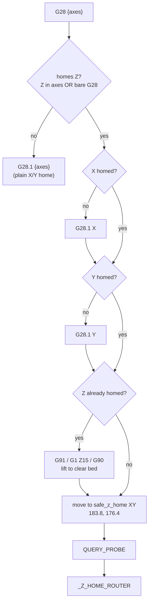

- Homes X then Y first (only if unhomed), lifts if Z was already homed, then
  **moves over the bed** before querying the probe — the Euclid seats as the
  carriage moves, so querying at the park position used to falsely read "detached."
- Note the explicit `G1 Z15` here is a *single* lift; `safe_z_home` also has
  `z_hop:15` (re-enabled for pickup clearance), which can add a second lift on a
  re-home — an accepted trade-off (see `safehome.cfg`).

### `_Z_HOME_ROUTER` — *EuclidUtilities.cfg · [internal]* — allow Z home only with probe

Reads the fresh `QUERY_PROBE` result. If **attached** (`not last_query`) → `G28.1 Z`
(probe-homes at the safe position). Otherwise → `_SAFETY_STOP` ("Z homing needs the
probe attached").

### `PROBE_PICKUP` — *EuclidUtilities.cfg* — fetch the probe by homing X

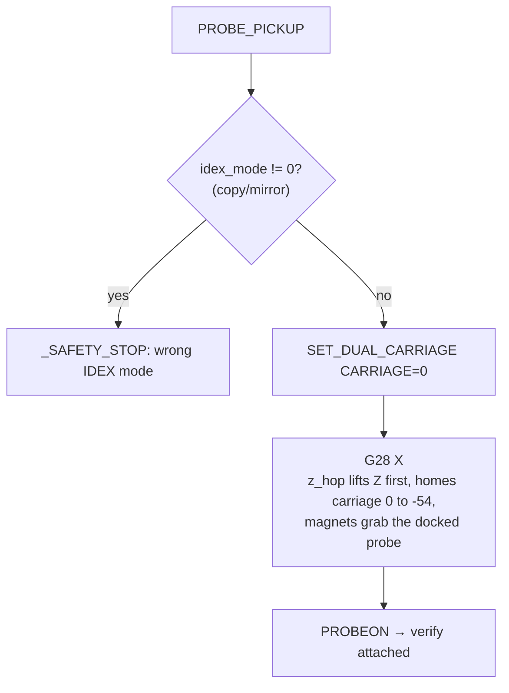

- **X-only on purpose:** the probe isn't attached yet and Z homes via the probe, so
  a full `G28` would fail. Blocker clearance comes from `safe_z_home`'s `z_hop`.

### `PROBE_DROPOFF` → `_PROBE_DROPOFF_SENSE` → `_PROBE_DROPOFF_STRIP` — *EuclidUtilities.cfg* — dock the probe

Three render stages so the live `PROBE` result is read *after* the probe move runs.

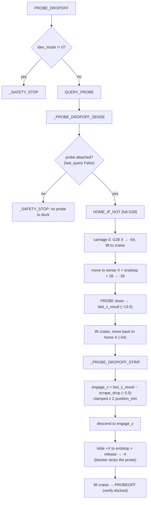

- Geometry is **endstop-relative**: dock X read live from `stepper_x.position_endstop`;
  `probe_dock_sense_xoffset` (28), `probe_dock_release` (50), `probe_dock_scrape_drop`
  (8) live in `LNLOS`.
- The blocker rides on the **static** frame; its Z varies vs the moving gantry →
  probe-sense it live. The scrape feature engages ~8 mm *below* the sense point.

### `BED_MESH_CALIBRATE` / `_GUARDED_MESH_CALIBRATE` — *EuclidUtilities.cfg* — mesh, guarded

Renames stock→`_BED_MESH_CALIBRATE_BASE`. Refuses to run without the probe:

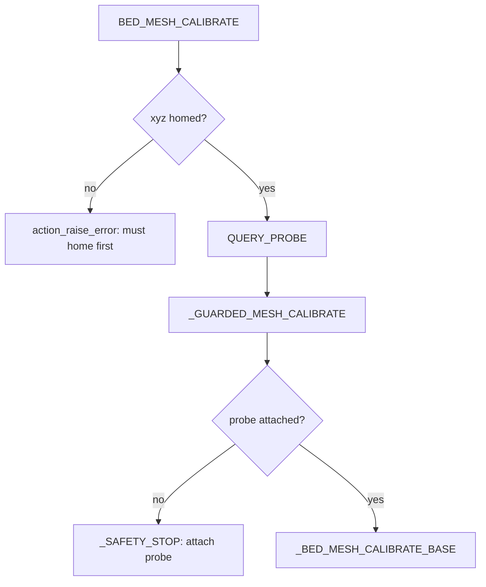

- Homed pre-check is at the **outer** level so the error echoes once (Klipper
  re-reports at each nesting level otherwise).

### `SCREWS_TILT_CALCULATE` / `_GUARDED_SCREWS_TILT` — *EuclidUtilities.cfg* — screws tilt, guarded

Identical guard pattern to `BED_MESH_CALIBRATE` (homed pre-check → fresh
`QUERY_PROBE` → `_SCREWS_TILT_CALCULATE_BASE` only if attached).

### `_Prepare_BedMesh` — *EuclidUtilities.cfg · [internal]* — pickup → home → mesh → dropoff

`PROBE_PICKUP` → **`G28`** (full-home, now that probe is on) → `BED_MESH_CALIBRATE`
→ `PROBE_DROPOFF`. The `G28` is required because pickup only homes X.

### `_AUTO_PROBE` — *EuclidUtilities.cfg · [internal]* — pickup → home → screws tilt → dropoff

Same as `_Prepare_BedMesh` but runs `SCREWS_TILT_CALCULATE`.

### Probe & safety helpers → see **§0 Foundations**

`PROBEON` / `PROBEOFF` / `_PROBE_VERIFY` (probe verification), `HOME_IF_NOT`,
`_SAFETY_STOP` / `_SAFETY_RAISE`, and the `LNLOS` settings holder are documented in
§0 — they're used across every subsystem, not just here.

---

# 2. IDEX

Files: `macros/idex.cfg`, `macros/E2OffsetTest.cfg`. Modes, tool activation,
parking, tool offsets, and the offset-tuning UI.

## Modes

### `_IDEX_MODE` — *idex.cfg* — mode state holder → see **§0 Foundations**

`idex_mode` = 0 dual · 1 copy · 2 mirror; every per-mode branch reads it. `CLEAR_GCODE_OFFSETS`
(also used below) is likewise in §0.

### `ACTIVATE_DUAL_MATERIAL_MODE` / `_APPLY_DUAL_MATERIAL_MODE` — *idex.cfg*

Interactive version **homes** (`G28`) then delegates to `_APPLY_DUAL_MATERIAL_MODE`,
which clears offsets, `ACTIVATE_EXTRUDER extruder`, `SET_DUAL_CARRIAGE 0`, `_IDEX_MODE MODE=0`.
The split exists so **cancel/print-start** can restore dual-material mode *without*
re-homing (a full `G28` needs the probe, which is off during a print).

### `ACTIVATE_COPY_MODE` — *idex.cfg* — both carriages print the same part

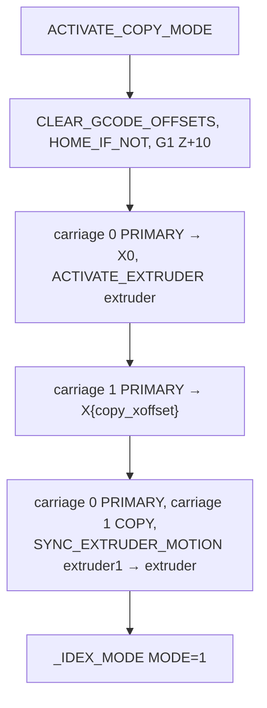

Clears the E2 tool offset first (both heads share one Z gantry, so a leftover offset
would shift both). `XOFFSET` param overrides the saved `copy_mode_xoffset`.

### `ACTIVATE_MIRROR_MODE` — *idex.cfg* — carriages mirror each other

Same shape as copy mode but ends `carriage 1 MIRROR` + `_IDEX_MODE MODE=2`, default
X offset 300.

### `_RESTORE_IDEX_MODE` — *idex.cfg · [internal]* — re-apply the stored mode

Reads `idex_mode` and calls the matching activate macro. Used at the end of
`PRINT_START`/`_PSP_FINISH_START` to resume the mode the user selected.

### Aliases

- **`ACTIVATE_DUPLICATION_MODE`** → `ACTIVATE_COPY_MODE` (KlipperScreen naming).
- **`ACTIVATE_TOOLCHANGER_MODE`** → `ACTIVATE_DUAL_MATERIAL_MODE`.

## Tool activation & parking

### `T0` / `T1` — *idex.cfg* — activate E1 / E2

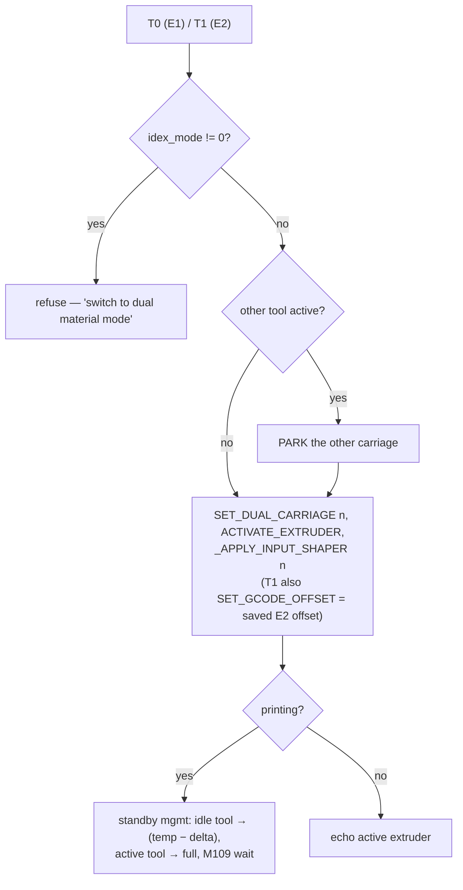

- Refuse **before** any move in copy/mirror mode (independent control is invalid there).
- `T1` applies the persisted E2 X/Y/Z offset *after* parking (park zeroes X/Y offset).
- Standby management runs only mid-print so a toolchange doesn't cold-swap.

### `PARK_extruder` / `PARK_extruder1` — *idex.cfg · [internal]* — park a carriage

Select the carriage, home its X if needed, then move it to its outer limit
(`stepper_x.position_min` / `dual_carriage.position_max`) so it's out of the way.

### `CLEAR_GCODE_OFFSETS` — *idex.cfg* — `SET_GCODE_OFFSET X=0 Y=0 Z=0`.

### `calibrate_z_e2` — *idex.cfg* — helper to set E2 Z by eye

`G28`, `T1`, then (dual-material only) lift, go to center, drop to Z0 and prompt the
user to adjust the E2 thumbwheel until the nozzle kisses the bed.

## Tool offsets (persisted in `save_variables`)

- **`SET_IDEX_TOOL_OFFSET X= Y= Z=`** — save the E2 (T1) tool offset.
- **`NUDGE_IDEX_OFFSET [X=][Y=][Z=]`** — add deltas to the saved E2 offset and, if E2
  is the active tool and homed, apply live (`SET_GCODE_OFFSET ... MOVE=1`) so tuning
  during a test print moves immediately. Refuses in copy/mirror.
- **`SHOW_IDEX_OFFSETS`** — echo saved E2 X/Y/Z + copy/mirror X offsets.
- **`SET_COPY_OFFSET X=` / `SET_MIRROR_OFFSET X=`** — save the copy/mirror X spacing.
- **`NUDGE_COPY_OFFSET X=` / `NUDGE_MIRROR_OFFSET X=`** — add a delta to it.
- **`COPY_OFFSET_PLUS01` / `COPY_OFFSET_MINUS01`** — ±0.1 mm copy offset (button shims).
- **`MIRROR_OFFSET_PLUS01` / `MIRROR_OFFSET_MINUS01`** — ±0.1 mm mirror offset.

## Offset-tuning UI (KlipperScreen dialog)

### `IDEX_OFFSET_PANEL` (+ `_IDEX_PANEL_STATE`, `_IDEX_SET_STEP`, `_IDEX_OFFSET_STEP`, `_PROMPT_CLOSE`)

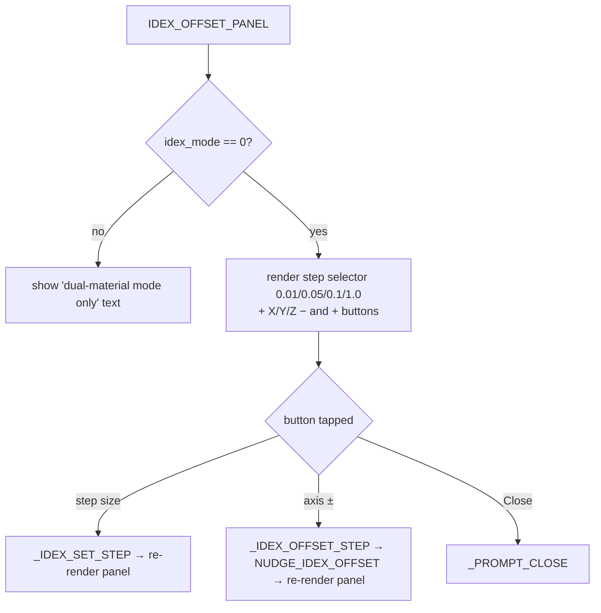

- **`_IDEX_PANEL_STATE`** holds the selected step size (mm/press).
- Each button action ends by re-opening `IDEX_OFFSET_PANEL`, so the dialog "refreshes"
  with the new value (KlipperScreen prompts have no live binding).
- **`_PROMPT_CLOSE`** — `action:prompt_end` (shared by many dialogs).

## E2 offset test print

### `IDEX_OFFSET_TEST` → `_IDEX_OFFSET_TEST_START` — *E2OffsetTest.cfg*

`IDEX_OFFSET_TEST` prompts for filament (PLA/PETG/ABS) unless `FILAMENT=` is passed,
then `_IDEX_OFFSET_TEST_START` heats, homes, loads the saved mesh, opens the offset
panel, and prints a **10 mm cube switching T0/T1 every 5 layers** — so mis-offset
shows as a visible seam. Ends with `END_PRINT`.

---

# 3. Print lifecycle

File: `macros/PrintStartEnd.cfg`. Start (two variants), end, and IDEX-aware cancel.

### `_TOOL_TEMPS` (+ `_SYNC_STANDBY_DELTA`) — *PrintStartEnd.cfg · [internal]* → see **§0 Foundations**

Per-tool print temps + standby delta, read by `T0`/`T1` and the start flows.

### `ASSERT_PROBE_DOCKED` → `_ASSERT_PROBE_DOCKED_CHECK` — *PrintStartEnd.cfg*

Fresh `QUERY_PROBE`; if the probe reads **attached**, it `CANCEL_PRINT`s (printing
with the probe on would crash it). Cancels rather than raises so heaters/state shut
down cleanly.

### `PRINT_START` — *PrintStartEnd.cfg* — headless start (already-homed machine)

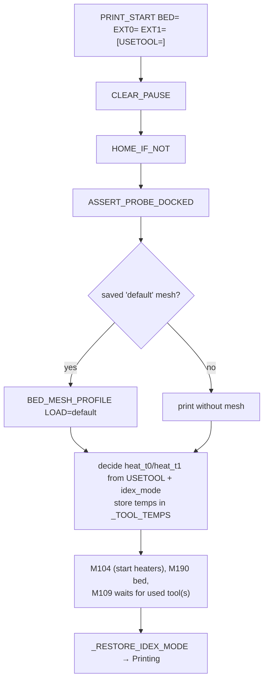

`USETOOL`: 0 = E1 only, 1 = E2 only, 2/default = both (copy/mirror always heats both).

### `PRINT_START_PROBED` — *PrintStartEnd.cfg* — interactive start (recommended)

A KlipperScreen-driven state machine that walks the operator through attach → level
→ remove, with capped retries. Heaters warm non-blocking during the prompts.

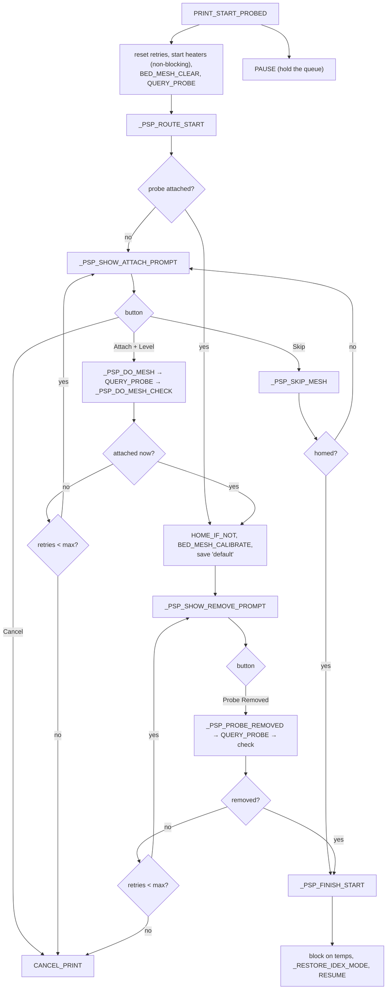

Supporting stages (all *[internal]*, all use the two-stage fresh-query pattern):
`_PSP_STATE` (retry counter), `_PSP_ROUTE_START`, `_PSP_SHOW_ATTACH_PROMPT`,
`_PSP_DO_MESH`/`_PSP_DO_MESH_CHECK`, `_PSP_SHOW_REMOVE_PROMPT`,
`_PSP_PROBE_REMOVED`/`_PSP_PROBE_REMOVED_CHECK`, `_PSP_SKIP_MESH`, `_PSP_FINISH_START`.

### `END_PRINT` — *PrintStartEnd.cfg*

`_MAINTENANCE_TRACKER` → `_RUNOUT_RESET_TOOLHEAD_SWAP` → retract, **clamped** Z lift,
heaters off, reset `_TOOL_TEMPS`, home X on **both** carriages, present the bed,
fan-cool 1 min, motors off.

### `CANCEL_PRINT` → `_VULCAN_CANCEL_CLEANUP` — *PrintStartEnd.cfg*

`CANCEL_PRINT` here is a **fallback** (renames stock→`CANCEL_PRINT_BASE`); when
`mainsail.cfg` loads it overrides this, and the cleanup runs via mainsail's
`user_cancel_macro` hook (`_CLIENT_VARIABLE`). Either way `_VULCAN_CANCEL_CLEANUP`:

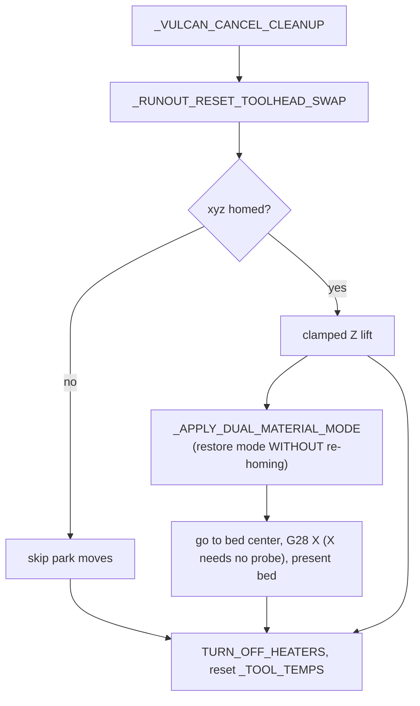

Key subtlety: it restores dual-material mode via `_APPLY_DUAL_MATERIAL_MODE` (no
`G28`) because a full home needs the probe, which is off during a print.

---

# 4. Filament (load / unload / runout)

Files: `macros/LoadUnloadFilament.cfg`, `filamentsensors.cfg`.

### `LOAD_FILAMENT` / `UNLOAD_FILAMENT` — *LoadUnloadFilament.cfg*

Require `xyz` homed. Optional `TOOL=` selects the extruder (else active). Lift Z
**relatively** (never toward the bed, clamped), home X, heat, then purge
(`+purge_distance`) or fast-unload (`−unload_distance` at the tool's
`max_extrude_only_velocity`). Wrapped in `SAVE/RESTORE_GCODE_STATE`.

### Runout sensors → `_RUNOUT_HANDLER` — *filamentsensors.cfg*

Two `filament_switch_sensor`s (on the freed old Z-endstop pins) call
`_RUNOUT_HANDLER TOOL=<0|1>`:

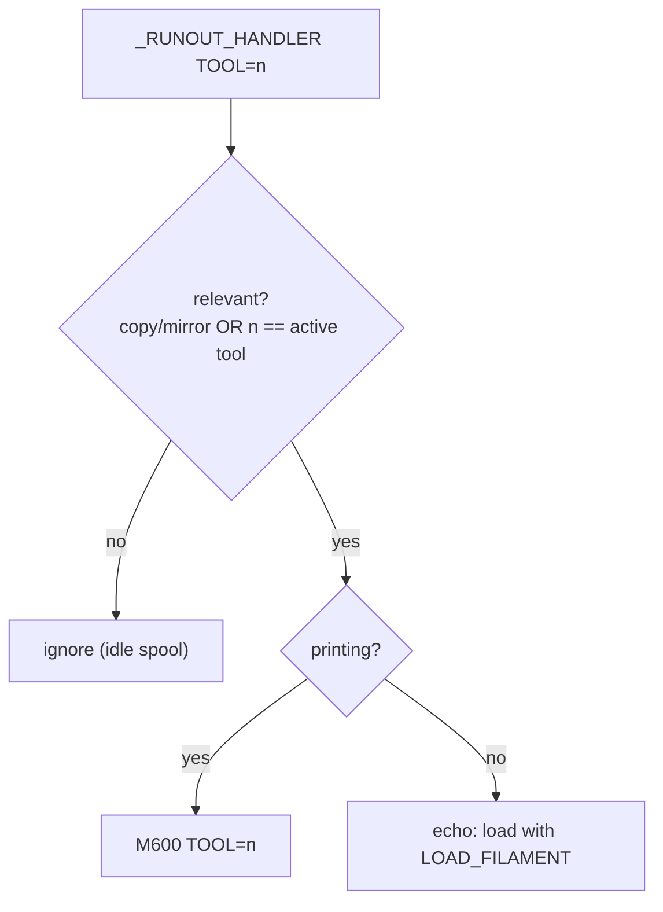

- In dual-material mode only the **active** carriage prints, so a runout on the idle
  tool's sensor is ignored (else an idle spool pauses an unrelated print).

### `M600` — *LoadUnloadFilament.cfg* — filament change

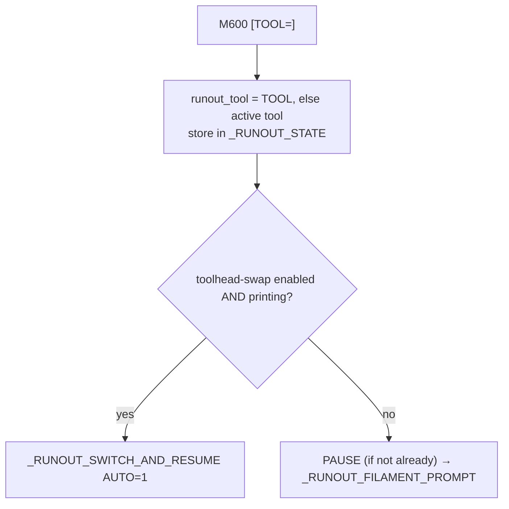

### `_RUNOUT_SWITCH_AND_RESUME` — *LoadUnloadFilament.cfg* — swap to the other tool

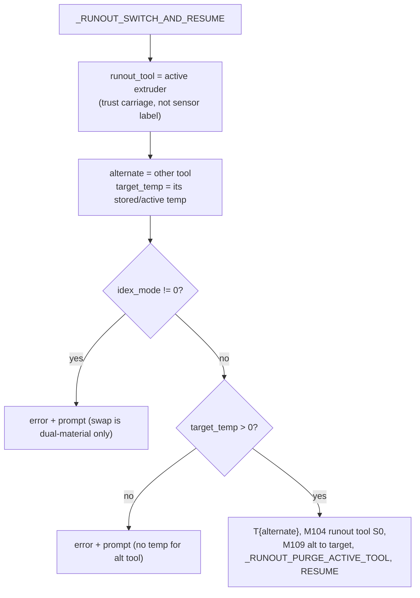

- Trusts the **active carriage** as the runout tool (a mislabeled sensor otherwise
  swaps to the tool already running). Turns the spent tool's heater fully off.

### Runout-swap toggle + prompt (all *LoadUnloadFilament.cfg*)

- **`_RUNOUT_STATE`** — holds `tool` and `toolhead_swap_enabled`.
- **`SET_RUNOUT_TOOLHEAD_SWAP ENABLE=<0|1>`** — set the toggle (validated).
- **`ENABLE_RUNOUT_TOOLHEAD_SWAP`** / **`DISABLE_RUNOUT_TOOLHEAD_SWAP`** /
  **`QUERY_RUNOUT_TOOLHEAD_SWAP`** — convenience wrappers around the toggle.
- **`RUNOUT_TOOLHEAD_SWAP_SELECTOR`** + **`_RUNOUT_SET_TOOLHEAD_SWAP`** — KlipperScreen
  enable/disable dialog (re-renders after each tap).
- **`_RUNOUT_RESET_TOOLHEAD_SWAP`** — force the toggle back to disabled; called by
  `END_PRINT`/cancel so it never persists across jobs.
- **`_RUNOUT_FILAMENT_PROMPT`** — the paused change dialog (Unload / Load / Switch
  Toolhead+Resume / Resume / Cancel).
- **`_RUNOUT_PURGE_ACTIVE_TOOL`** — purge the active tool at the park position
  (clamped to the tool's max extrude velocity) before resuming.

---

# 5. Heaters / tuning / resonance

### `M109` — *m109_fast_wait.cfg* — return when temp first reached (skip PID settle)

Renames stock→`M99109`. Sets the target via `M104 {rawparams}`, then
`TEMPERATURE_WAIT SENSOR=<mapped> MINIMUM={S}` — returns as soon as temp ≥ target
(no slope/settle wait), saving ~15–20 s on **every** heat-wait (print start,
toolchange, runout swap, load/unload). Maps `T0`→`extruder`, `T1`→`extruder1`, else
the active extruder.

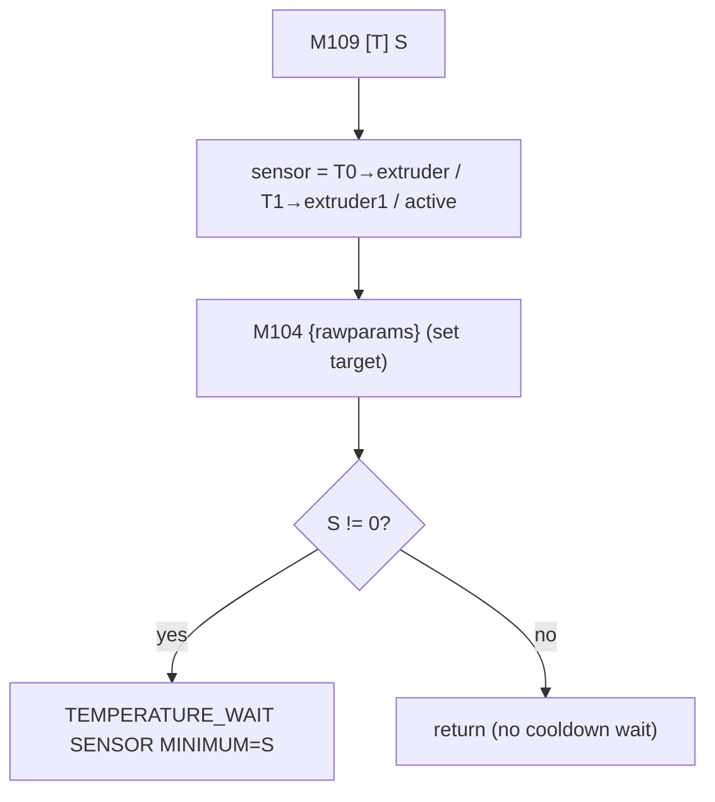

> **Limitation (intentional):** `MINIMUM`-only means an `M109` to a *lower* temp
> won't block to cool. Safe here because cooldown always uses `M104 S0`.

### `PID_ALL` / `PID_EXTRUDERS` / `PID_BED` — *pidutilities.cfg*

Preheat, then `PID_CALIBRATE` the relevant heater(s) to the targets in `LNLOS`
(`extruder_pid_target`, `bed_pid_target`), then `SAVE_CONFIG` (restarts Klipper).

### `_IS_SETTINGS` / `_APPLY_INPUT_SHAPER` — *inputshaper.cfg*

- **`_IS_SETTINGS`** — per-carriage X shaper freq/type holder (X resonance differs
  between the two carriages; Y is shared).
- **`_APPLY_INPUT_SHAPER CARRIAGE=<0|1>`** — apply that carriage's X shaper.
  **No-ops** unless `[input_shaper]` is enabled, so it's always safe to call.
  Invoked by `T0`/`T1` on every toolchange.

---

# 6. Settings / helpers / UI / maintenance

Several helpers here are **prerequisites** covered in §0 Foundations: `LNLOS`,
`_SAFETY_STOP` / `_SAFETY_RAISE`, `HOME_IF_NOT`, and `_CLIENT_VARIABLE`. The
maintenance/support helpers unique to this section:

- **`_MAINTENANCE_TRACKER`** — *_host_deps.cfg · [internal]* — called by `END_PRINT`;
  accumulates lifetime print count + hours into `save_variables`.
- **`MAINTENANCE_STATUS`** — *_host_deps.cfg* — echo lifetime prints / hours.
- **`SUPPORT_INFO`** — *support.cfg* — customer support card (console + touchscreen),
  with live lifetime prints/hours. Keep values in sync with the KlipperScreen Support
  menu labels (menu names can't interpolate state).

> **Not macros (config only):** `verifyheaters.cfg` (`[verify_heater]` sections) and
> `filamentsensors.cfg`'s `[filament_switch_sensor]` blocks — included here only for
> the `runout_gcode` hook that calls `_RUNOUT_HANDLER`.

---

## Appendix: recurring patterns cheat-sheet

| Pattern | Where you'll see it | Why |
|---|---|---|
| **Two-stage fresh query** (A runs `QUERY_PROBE`, B reads it) | `PROBEON/OFF`, `PROBE_DROPOFF`, all `_PSP_*`, `ASSERT_PROBE_DOCKED` | templates render before commands run |
| **Guard before move** (`` first) | `T0/T1`, `PROBE_PICKUP/DROPOFF`, offset macros | refuse invalid ops before anything moves |
| **Clamped Z lift** `[[Δ, max−pos]\|min, 0]\|max` | `END_PRINT`, cancel, load/unload | never exceed Z travel, never move toward bed |
| **State holder macro** (no-op body, `variable_*`) | `LNLOS`, `_TOOL_TEMPS`, `_IDEX_MODE`, `_RUNOUT_STATE`, `_PSP_STATE`, `_IS_SETTINGS` | persist small state between macros |
| **`rename_existing`** to wrap a builtin | `G28`, `M109`, `CANCEL_PRINT`, `BED_MESH_CALIBRATE`, `SCREWS_TILT_CALCULATE` | add guards/behavior around stock commands |
| **Endstop-relative geometry** (read `position_endstop`) | probe dock, parking | survive config changes; no magic numbers |

*Generated as a reference for future work. When you change a macro's flow, update
its entry here.*

